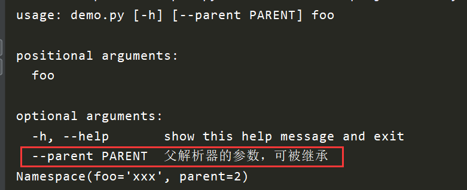
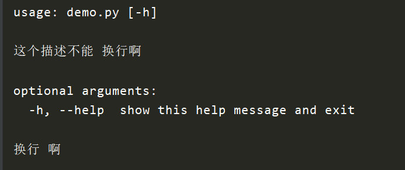
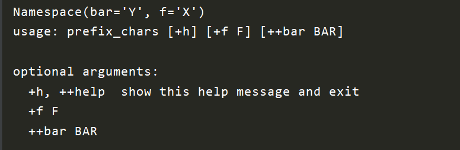
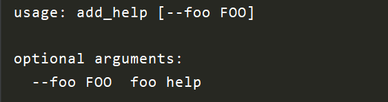

# python argparse库

argparse是python的标准库，他可以使我们很友好的编写命令行界面，并且可以自动生成帮助文档和使用消息，并在参数无效的时候发出错误。

### argparse.ArgumentParse类参数
1. prog：改变应用的名字，并且我们也可以使用`%(prog)s`引用应用的名字，默认的应用名字为文件名。
```python
import argparse

def prog_demo():
    parser = argparse.ArgumentParser(prog='my_progress')
    
    # help参数中我们就引用了prog参数的值
    parser.add_argument('--foo', help='foo of the %(prog)s program')
    
    # parser.parse_args解析参数，需要传入一个数组
    parser.parse_args('-h'.split())
```


2. usage: 显示这个命令用法, 一般用来显示参数的用法
```python
def usage_demo():
    # usage: 改变usage 显示信息
    parser = argparse.ArgumentParser(prog='usage_demo', usage='%(prog)s [options] demo')
    parser.add_argument('--foo', nargs='?', help='foo help')
    parser.parse_args('-h'.split())
```


3. description：显示这个命令的帮助信息
```python
def description_demo():
    # description:
    parser = argparse.ArgumentParser(description='这个命令是用来显示description信息的')
    parser.parse_args('-h'.split())
```


4. epilog: 显示命令的帮助信息，位置在参数的下面
```python
def epilog_demo():
    parser = argparse.ArgumentParser(description='这个命令是用来显示description信息的', epilog='显示在参数之后的描述信息')
    parser.parse_args('-h'.split())
```


5. parents: 指定父解析器，可以多个，为一个列表
```python
def parents_demo():
    # 如果多个解析器可能有相同的参数集， 那么我们可以给他抽取出来， 然后指定parents参数，就是和父类一样的效果
    # 注意：父类的解析器必须得使add_help参数为False

    parent_parser = argparse.ArgumentParser(add_help=False)
    parent_parser.add_argument('--parent', type=int, help='父解析器的参数，可被继承')

    foo_parser = argparse.ArgumentParser(parents=[parent_parser])
    foo_parser.add_argument('foo')
    foo_parser.print_help()
    result = foo_parser.parse_args(['--parent', '2', 'xxx'])
    print(result)
```


6. formatter_class: 指定帮助信息的格式
```python
def formatter_class_demo():
    # 默认是不能换行的，会将\n变成一个空格
    # parser = argparse.ArgumentParser(description='这个描述不能\n换行啊', epilog='换行\n啊')
    # parser.print_help()

    # 使用这个之后能能换行了
    parser = argparse.ArgumentParser(description='这个描述不能\n换行啊', epilog='换行\n啊', formatter_class=argparse.RawDescriptionHelpFormatter)
    parser.print_help()
```



7. prefix_chars: 指定参数前缀
```python
def prefix_chars_demo():
    # 一般情况下，我们使用-作为前缀，我们也可以自定义选项前缀。
    parser = argparse.ArgumentParser(prog='prefix_chars', prefix_chars='+')
    parser.add_argument('+f')
    parser.add_argument('++bar')
    result = parser.parse_args(['+f', 'X', '++bar', 'Y'])
    print(result)
    parser.print_help()
```


8. add_help: 是否禁用add_help参数
```python
def add_help_demo():
    # 是否禁用-h --help选项
    parser = argparse.ArgumentParser(prog='add_help', add_help=False)
    parser.add_argument('--foo', help='foo help')
    parser.print_help()
```



### argparse.ArgumentParser.add_argument函数理解
1. name | flags: 指定参数的名字:
```python
def name_demo():
    parser = argparse.ArgumentParser()
    # 可选参数-a | --age
    parser.add_argument('-a', '--age')
    # 位置参数 name
    parser.add_argument('name')
    result = parser.parse_args(['xxx'])
    print(result)
    result = parser.parse_args(['-a', '18', 'xxx'])
    print(result)
    result = parser.parse_args(['--age', '20', 'xxx'])
    print(result)
   
###########
# 运行结果 #
###########
Namespace(age=None, name='xxx')
Namespace(age='18', name='xxx')
Namespace(age='20', name='xxx')
```

2. action: 指定命令行参数，内置的一下几种

* store: 默认值，仅仅保存参数值。
```python
def action_demo():
    # 指定命令行参数，内置的有下面几种
    parser = argparse.ArgumentParser()

    # * store: 默认值，仅仅保存参数值，不做处理
    parser.add_argument('-f', action='store')
    result = parser.parse_args('-f 1'.split())
    print(result)

###########
# 运行结果 #
###########
Namespace(f='1')
```
* store_const: 与store基本一致，但是只保存const关键字指定的值，其它的值就会报错
```python
def acton_demo():
    parser = argparse.ArgumentParser()
    
    parser.add_argument('-f', action='store_const', const=18)
    result = parser.parse_args('-f'.split())
    print(result)
    # 报错，const指定的是18整数，-f 18得到的是字符窜
    result = parser.parse_args('-f 18'.split())
    print(result)
  
###########
# 运行结果 #
###########  
Namespace(f=18)
usage: demo.py [-h] [-f]
demo.py: error: unrecognized arguments: 18
```

* store_true | store_false: 与store_const基本一致，只保存True和False
```python
def acton_demo():
    parser = argparse.ArgumentParser()
    
    parser.add_argument('-f', action='store_true')
    parser.add_argument('-b', action='store_false')
    result = parser.parse_args('-f -b'.split())
    print(result)

###########
# 运行结果 #
########### 
Namespace(b=False, f=True)
```

* append: 将相同的参数的不同值保存在一个list中
```python
def acton_demo():
    parser = argparse.ArgumentParser()
    
    parser.add_argument('-f', action='append')
    result = parser.parse_args('-f 1 -f 2 -f 3'.split())
    print(result)

###########
# 运行结果 #
########### 
Namespace(f=['1', '2', '3'])
```

* count: 统计参数出现的次数
```python
def acton_demo():
    parser = argparse.ArgumentParser()
    
    parser.add_argument('-verbose', '-v', action='count')
    # 下面两句效果相同
    result = parser.parse_args('-v -v -v'.split())
    result = parser.parse_args('-vvv'.split())
    print(result)

###########
# 运行结果 #
########### 
Namespace(verbose=3)
```

* help: 输出程序的帮助信息
```python
def acton_demo():
    parser = argparse.ArgumentParser()
    
    parser.add_argument('-f', action='help')
    result = parser.parse_args('-f'.split())
    print(result)

###########
# 运行结果 #
########### 
usage: demo.py [-h] [-f]

optional arguments:
  -h, --help  show this help message and exit
  -f
```

* version: 输出程序版本信息
```python
def acton_demo():
    parser = argparse.ArgumentParser(prog='version_demo')
    
    parser.add_argument('-v', action='version', version='%(prog)s 2.0')
    result = parser.parse_args('-v'.split())
    print(result)

###########
# 运行结果 #
########### 
version_demo 2.0
```

3. nargs: 将不同数量的值与一个参数关联起来

* nargs=N:N为整数:
```python
def nargs_demo():
    parser = argparse.ArgumentParser()
    
    # 指定两个值与f参数关联起来
    parser.add_argument('-f', nargs=2)
    # 指定一个值与name参数关联起来
    parser.add_argument('name', nargs=1)
    result = parser.parse_args('-f a b c'.split())
    print(result)

###########
# 运行结果 #
########### 
Namespace(f=['a', 'b'], name=['xxx'])
```

* nargs='?':
    - 如果给出了参数值，那么就为给出的值，
    - 如果没有给出参数值，就会使用const关键字的值，
    - 如果不存在这个参数， 将生成默认值
```python
def nargs_demo():
    parser = argparse.ArgumentParser()
    
    parser.add_argument('-age', nargs='?', const='18', default='0')
    result = parser.parse_args('-age 20'.split())
    print(result)
    result = parser.parse_args('-age'.split())
    print(result)
    result = parser.parse_args()
    print(result)

###########
# 运行结果 #
########### 
Namespace(age='20')
Namespace(age='18')
Namespace(age='0')
```

* nargs='*': 将所有的参数保存在列表中
```python
def nargs_demo():
    parser = argparse.ArgumentParser()
    
    parser.add_argument('-f', nargs='*')
    parser.add_argument('-b', nargs='*')
    parser.add_argument('names', nargs='*')
    result = parser.parse_args('xx xxx -f a b -b a b c'.split())
    print(result)

###########
# 运行结果 #
########### 
Namespace(b=['a', 'b', 'c'], f=['a', 'b'], names=['xx', 'xxx'])
```

* nargs='+': 将所有的参数保存在列表中，但是至少得有一个参数
```python
def nargs_demo():
    parser = argparse.ArgumentParser()
    
    parser.add_argument('-f', nargs='+')
    parser.add_argument('-b', nargs='+')
    parser.add_argument('names', nargs='+')
    result = parser.parse_args('xx xxx -f a b -b a b c'.split())
    print(result)

###########
# 运行结果 #
########### 
Namespace(b=['a', 'b', 'c'], f=['a', 'b'], names=['xx', 'xxx'])
```

* nargs=argparse.REMAINDER: 其余的参数全部保存在一个list中
```python
def nargs_demo():
    parser = argparse.ArgumentParser()
    
    parser.add_argument('-f')
    parser.add_argument('-b')
    parser.add_argument('args', nargs=argparse.REMAINDER)
    result = parser.parse_args('-f a -b a b -names xxx xxxx'.split())
    print(result)

###########
# 运行结果 #
########### 
Namespace(args=['b', '-names', 'xxx', 'xxxx'], b='a', f='a')
```

4. default: 如果没有传入这个参数，默认使用default参数的值
```python
def default_demo():
    parser = argparse.ArgumentParser()
    parser.add_argument('-age', default=18)
    result = parser.parse_args()
    print(result)
    result = parser.parse_args('-age 10'.split())
    print(result)
    
###########
# 运行结果 #
###########
Namespace(age=18)
Namespace(age='10')
```

5. type: 接收到的参数会经过这个参数对应的函数处理。
```python
def type_func(value):
    print("type func " + value)
    return value

def type_demo():
    # type 接收到的参数会经过这个函数的处理， 再返回
    parser = argparse.ArgumentParser()
    parser.add_argument('f', type=int)
    parser.add_argument('file', type=type_func)
    result = parser.parse_args('18 temp.txt'.split())
    print(result)
    
###########
# 运行结果 #
###########
type func temp.txt
Namespace(f=18, file='temp.txt')
```

6. choices: 将参数指定在一个范围内，超出就报错
```python
def choices_demo():
    parser = argparse.ArgumentParser()
    parser.add_argument('move', choices=['left', 'middle', 'right'])
    result = parser.parse_args('left'.split())
    print(result)
    
###########
# 运行结果 #
###########
Namespace(move='left')
```

7. required: 指定参数是否为必传参数。
```python
def required_demo():
    # 指定命令行参数是否必须，默认通过-f --foo指定的额参数为可选参数, 及可以为空
    parser = argparse.ArgumentParser()
    parser.add_argument('--foo', required=True)
    result = parser.parse_args('--foo f'.split())
    print(result)
    
###########
# 运行结果 #
###########
Namespace(foo='f')
```

8. dest: 自定义参数的名称，默认名称为-后面的值或者--后面的值.
```python
def dest_demo():
    parser = argparse.ArgumentParser()
    parser.add_argument('-n', '--name', '--na')
    parser.add_argument('-a', dest='age')
    parser.add_argument('--gender', '-g')

    result = parser.parse_args('-n xxx -a 18 -g 男'.split())
    print(result)
    result = parser.parse_args('--na xxx -a 18 -g 男'.split())
    print(result)
    result = parser.parse_args('--name xxx -a 18 -g 男'.split())
    print(result)
    
###########
# 运行结果 #
###########
Namespace(age='18', gender='男', name='xxx')
Namespace(age='18', gender='男', name='xxx')
Namespace(age='18', gender='男', name='xxx')
```
